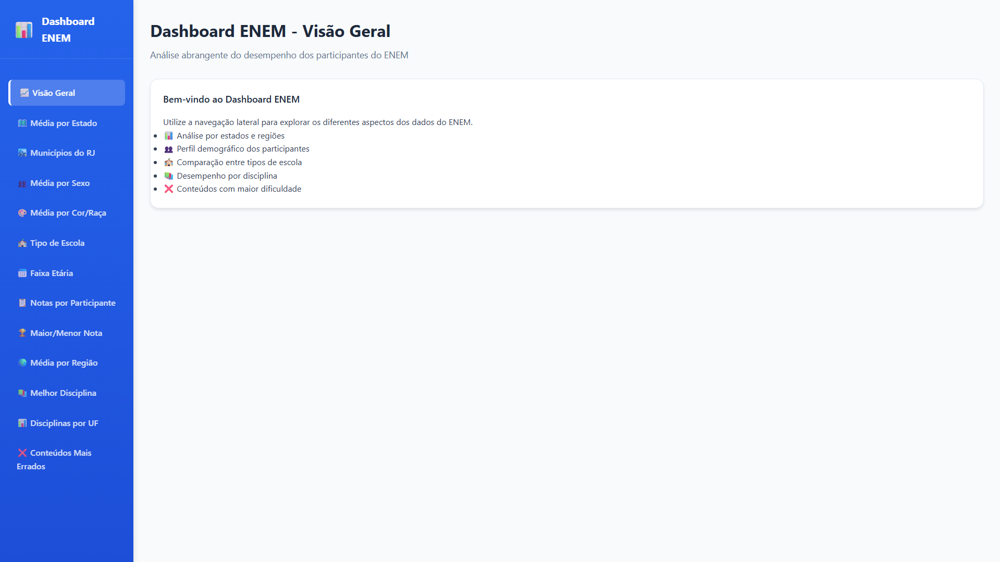
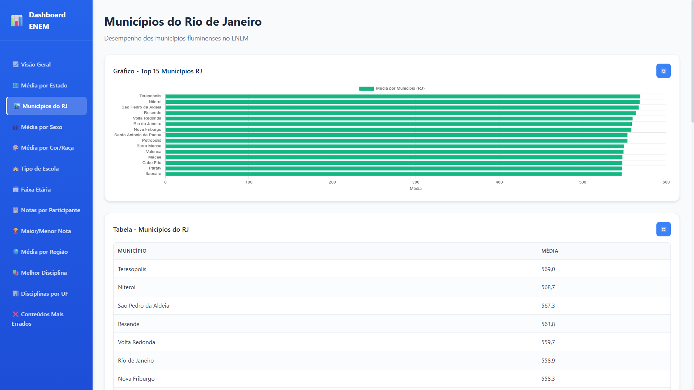
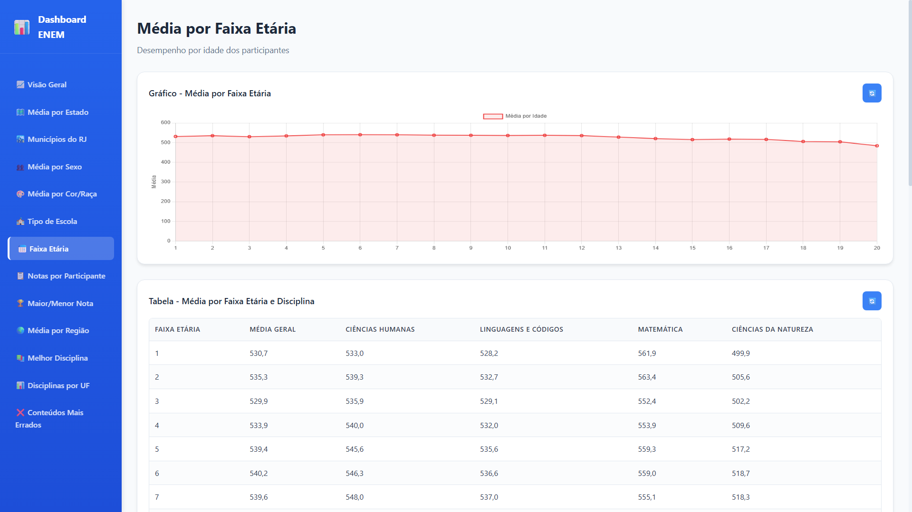

# ENEM Data Dashboard

Dashboard acadêmico para visualização de indicadores relacionados ao desempenho no ENEM.

O projeto foi desenvolvido em grupo como trabalho acadêmico, para a disciplina de Banco de Dados, utilizando consultas SQL em banco MySQL, uma API em Flask e uma interface web com HTML, CSS e JavaScript.

## Capturas de tela

### Dashboard principal

### Médias por município do RJ

### Análise por faixa etária

## Tecnologias

- Python
- Flask
- MySQL
- SQL
- HTML/CSS
- JavaScript
- Chart.js

## Funcionalidades

- Visualização de médias por estado e município
- Análises por sexo, cor/raça, faixa etária e tipo de escola
- Consultas SQL organizadas por tipo de análise
- Dashboard web para exibição dos resultados
- Integração entre front-end e API local em Flask

## Estrutura

- `app.py`: API em Flask para consulta dos dados
- `dashboard-enem/`: interface web do dashboard
- `sql/`: consultas SQL utilizadas nas análises

## Observação

O banco de dados utilizado no projeto não está incluído no repositório. Para executar o projeto localmente, é necessário configurar um banco MySQL compatível com as consultas SQL presentes na pasta `sql/`.

## Status

Finalizado.